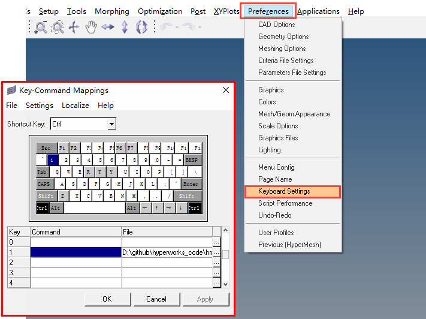
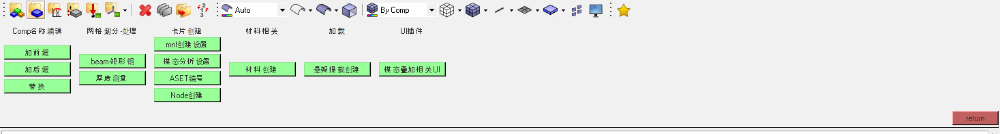

# TclPyHyperWorks
+ 有限元
+ hyperworks 相关模块, 以hypermesh前处理为主  

### version版本
+ hyperworks 13.0 / 2017 /2021.1
+ python 3.7
+ tcl

### 模块

+ 00.Example: 参考代码
+ 01.Project 子项目 [综合应用类]
  + 00.CmfRead:  hm自生成代码文件的数据读取解析
  + 01.AutoRun: 自运行挂机程序
  + 02.Opt_Fatigue:  optistruct fatigue 求解优化程序
  + 03.HG2D_Modal_Stress_Super:  虚拟应力数据读取[模态坐标线性应力叠加]
  + 04.FatigueElemToNcodeGroup:  生成Ncode的UserGroup用于耐久计算材料属性赋予
  + 20.feon_learning: 有限元框架Feon学习
+ 21.Platform_ARB: 稳定杆计算平台开发研究
  
+ 02.hm : hypermesh相关二次开发
+ 02.hm_v2: 暂停
+ 03.hv : hyperview相关二次开发
  + hvStrainPoint: 应变测点评估, 后处理输出 ing
+ 04.hg2d: hypergraph 2d相关二次开发
+ tests : 部分测试用文件存放

### 文件
+ py_file_del : 计算文件删除
+ py_zip : 压缩文件, 用于备份
+ ing_py_funForTCLtest : tcl调用python测试
+ ing_py_hmBatRun : 外部调用 hmbatch.exe

### 示例

快捷键设置

hmGUI界面
